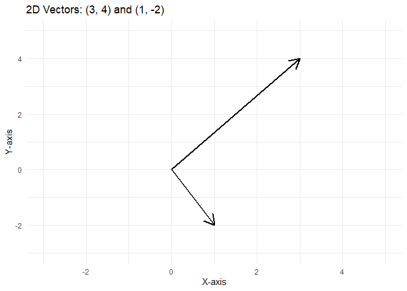
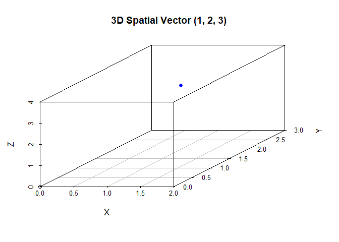

# 1. Definition of a Vector

A vector is an ordered list of numbers called components.

**v** = (*v*1, *v*2, …, *v**n*)

------------------------------------------------------------------------

# 2. Vectors in ℝ*n*

## 2.1 Definition

A real vector is written as:

**v** = (*v*1, *v*2, …, *v**n*),  *v**i* ∈ ℝ

------------------------------------------------------------------------

## 2.2 Example: 2D Vector

**a** = (3, 4)

------------------------------------------------------------------------

## 2.3 Example: 3D Vector

**b** = (1, 2, 3)

------------------------------------------------------------------------

## 2.4 Plot: 2D Vectors

    ## Warning: Using `size` aesthetic for lines was deprecated in ggplot2 3.4.0.
    ## ℹ Please use `linewidth` instead.
    ## This warning is displayed once every 8 hours.
    ## Call `lifecycle::last_lifecycle_warnings()` to see where this warning was
    ## generated.

# 3. Vectors in ℂ*n*

## 3.1 Definition

A complex vector is written as:

**w** = (*w*1, *w*2, …, *w**n*),  *w**i* ∈ ℂ

where:

$$
w\_i = a + b i, \quad a, b \in \mathbb{R}, \quad i = \sqrt{-1}
$$

------------------------------------------------------------------------

## 3.2 Example: Complex Vector in ℂ3

**c** = (1 + 2*i*, −3*i*, 4)

------------------------------------------------------------------------

## 3.3 Application Note

Complex vectors are widely used in: - Quantum mechanics - Electrical
engineering - Signal processing

# 4. Spatial Vectors

## 4.1 Definition

A **spatial (physical) vector** is a quantity that has: - **Magnitude**
(size or length) - **Direction** (orientation)

Examples of spatial vectors include: - Displacement - Velocity - Force

------------------------------------------------------------------------

## 4.2 Example: 2D Displacement Vector

Given:

**d** = (3, 4)

Magnitude:

$$
|\mathbf{d}| = \sqrt{3^2 + 4^2} = 5
$$

------------------------------------------------------------------------

## 4.3 Example: 3D Displacement Vector

Given:

**e** = (1, 2, 3)

Magnitude:

$$
|\mathbf{e}| = \sqrt{1^2 + 2^2 + 3^2} = \sqrt{14} \approx 3.74
$$

------------------------------------------------------------------------

## 4.4 Visual Plot: 3D Vector

# 5. Basic Vector Operations

------------------------------------------------------------------------

## 5.1 Addition

Given two vectors:

**v****1** = (1, 2),  **v****2** = (3, 4)

The addition is:

**v****1** + **v****2** = (1 + 3, 2 + 4) = (4, 6)

------------------------------------------------------------------------

## 5.2 Scalar Multiplication

Given:

2 ⋅ (3, 4) = (2 × 3, 2 × 4) = (6, 8)

------------------------------------------------------------------------

## 5.3 Dot Product

Given:

**v****1** = (1, 2),  **v****2** = (3, 4)

The dot product is:

**v****1** ⋅ **v****2** = 1 × 3 + 2 × 4 = 11

------------------------------------------------------------------------

## 5.4 Norm (Length)

Given:

**v** = (3, 4)

The norm (magnitude) is:

$$
|\mathbf{v}| = \sqrt{3^2 + 4^2} = 5
$$

------------------------------------------------------------------------

## 5.5 Example R Code

    # Define two 2D vectors
    v1 <- c(1, 2)
    v2 <- c(3, 4)

    # Addition
    v1 + v2

    ## [1] 4 6

    # Scalar multiplication
    2 * v1

    ## [1] 2 4

    # Dot product
    sum(v1 * v2)

    ## [1] 11

    # Norm (length)
    sqrt(sum(v1^2))

    ## [1] 2.236068

1.  Summary

-   ℝ*n*: Real vectors

-   ℂ*n*: Complex vectors

-   Spatial vectors: Physical quantities with size + direction

Vectors are essential in:

-   Math
-   Physics
-   Engineering
-   Data science
